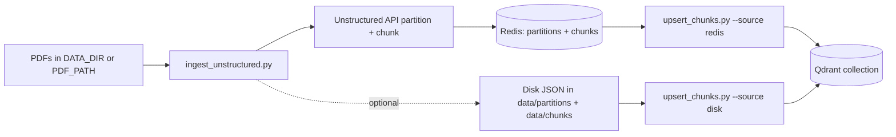
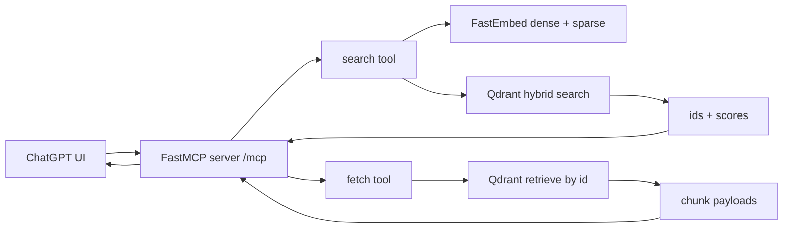
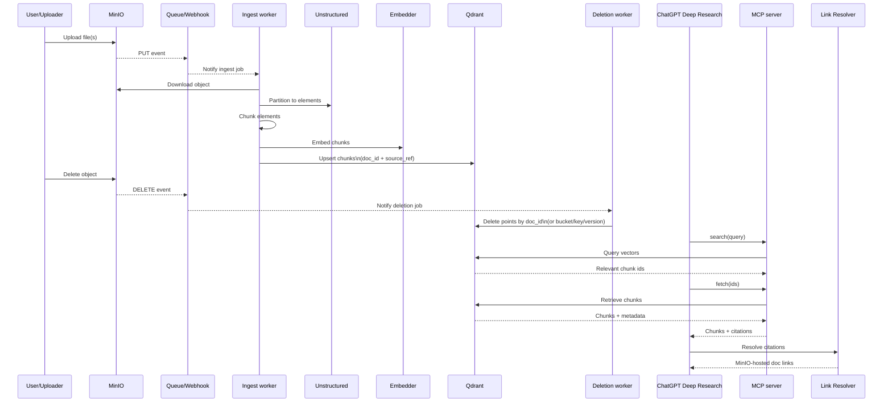
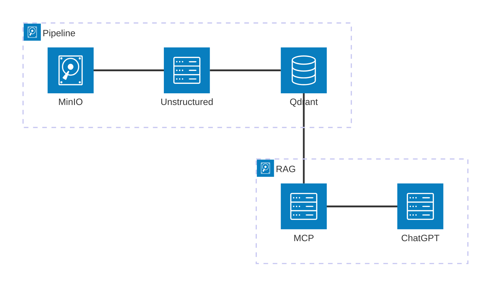

# Local MCP Research Server

FastMCP server for local retrieval and citation tooling backed by Qdrant, Redis, and MinIO. The MCP server runs without GitHub OAuth or Cloudflare.

## Requirements
- Python 3.12+
- Docker + Docker Compose (optional)

## Install
Create a virtualenv and install dependencies:
```bash
python -m venv .venv
. .venv/bin/activate
pip install -r requirements.txt
```

(Optional) install the package in editable mode:
```bash
pip install -e .
```

## Environment Variables
Set these in your shell or a local `.env`:
- `QDRANT_URL` (default `http://localhost:6333`)
- `QDRANT_COLLECTION` (default `pdf_chunks`)
- `REDIS_URL` (default `redis://localhost:6379/0`)
- `REDIS_PREFIX` (default `unstructured`)
- `CITATION_BASE_URL` (default `http://localhost:8080`)
- `CITATION_REF_PATH` (default `/r/doc`)

## Run Locally
```bash
python mcp_app.py
```
The server listens on `http://localhost:8000` and serves MCP at `http://localhost:8000/mcp`.

## Run with Docker
Build and start local services:
```bash
docker compose up --build
```
- `mcp` service: HTTP MCP on port 8000.
- `resolver` service: citation resolver API on port 8080.
- `minio` service: object storage with console on port 9001.
- `dashboard` service: bucket/file dashboard on port 8002.

Open the dashboard at `http://localhost:8002` to browse Qdrant collections (buckets) and see per-file metadata from Qdrant + Redis.

## Automatic BibTeX enrichment (Crossref)
Use `bibtex_autofill.py` to batch-populate BibTeX metadata for PDFs using:
- MinIO object metadata (title/author/doi fields).
- Redis first-page extracted text from `unstructured:pdf:*` chunk/partition payloads.
- Crossref lookup/search for final bibliographic fields.

The script writes into the same Redis keys used by the BibTeX UI:
- `bibtex:file:<bucket>/<object>`
- `bibtex:files`

Key environment:
- `REDIS_URL` (or `BIBTEX_REDIS_URL`)
- `BIBTEX_REDIS_PREFIX` (default `bibtex`)
- `BIBTEX_SOURCE_REDIS_PREFIX` (default `REDIS_PREFIX` or `unstructured`)
- `MINIO_ENDPOINT`, `MINIO_ACCESS_KEY`, `MINIO_SECRET_KEY`
- `CROSSREF_MAILTO` (recommended for Crossref etiquette/rate limiting)
- `CROSSREF_MATCH_CONFIDENCE_THRESHOLD` (default `0.85`)
- `CROSSREF_MIN_TITLE_SIMILARITY` (default `0.55`)
- `CROSSREF_MIN_AUTHOR_OVERLAP` (default `0.25`)

Autofill applies only when confidence gates pass. Low-confidence and DOI-conflict candidates are skipped.

Example:
```bash
python bibtex_autofill.py --bucket my-bucket --limit 200 --batch-size 25
```

Dry run (no writes):
```bash
python bibtex_autofill.py --bucket my-bucket --dry-run
```

## Exposed Tools
- `ping`: health check returning `"pong"`.
- `list_collections`, `set_default_collection`, `list_collection_files`
- `search`, `fetch`
- `resolve_citation`, `fetch_document_chunks`

## MinIO buckets and uploads (UI)
The compose stack includes MinIO with a web console so you can create multiple buckets and upload files through a UI.

Start MinIO:
```bash
docker compose up minio
```

Open the console at `http://localhost:9001` and sign in with:
- `MINIO_ROOT_USER` (default `minioadmin`)
- `MINIO_ROOT_PASSWORD` (default `minioadmin`)

Storage is persisted in a Docker volume (`minio_data`) so buckets and objects survive container restarts.

## MinIO upload -> Unstructured -> Qdrant (auto-ingest)
Use `minio_ingest.py` (or the `minio_ingest` compose service) to listen for new uploads and run the Unstructured ingest process automatically. Each upload is upserted into a Qdrant collection named after the bucket, while partitions and chunks are still stored in Redis. A Redis set tracks which collections each document belongs to so a single file can map to multiple collections.
If `MINIO_ENQUEUE_CELERY=1`, uploads are queued to the Celery worker instead of being processed in the listener process (make sure the `celery` service is running).

Example (Docker Compose):
```bash
# Listen to all buckets at startup
MINIO_ALL_BUCKETS=1 UNSTRUCTURED_API_KEY=your-key docker compose up minio_ingest
```

Key env vars:
- `MINIO_ENQUEUE_CELERY` (default `1` in compose, set to `0` to process inline)
- `MINIO_ENDPOINT` (default `minio:9000`)
- `MINIO_BUCKETS` (comma-separated bucket list) or `MINIO_ALL_BUCKETS=1`
- `MINIO_SUFFIX` (default `.pdf`)
- `MINIO_EVENTS` (default `s3:ObjectCreated:*,s3:ObjectRemoved:*`)
- `MINIO_SKIP_EXISTING` (default `1`, skip if document already mapped to the bucket)
- `UNSTRUCTURED_API_KEY` (required when new files need parsing)

Redis mapping keys:
- Document -> collections set: `unstructured:pdf:<document_id>:collections`

## Project Layout
- `src/mcp_research/` – core Python modules.
- Top-level scripts (`mcp_app.py`, `hybrid_search.py`, `ingest_unstructured.py`, `upsert_chunks.py`) are thin wrappers for local CLI use.
- `docs/` – Sphinx documentation sources.

## PDF -> Qdrant ingestion
Use `ingest_pdfs.py` to extract text from PDFs with PyMuPDF, chunk it, embed with SentenceTransformers, and push vectors to the local Qdrant instance.

Environment (examples):
- `DATA_DIR` – directory containing PDFs when `PDF_PATH` is not set (default `data-raw`).
- `PDF_PATH` – optional path to a single PDF or a directory to ingest.
- `QDRANT_HOST` / `QDRANT_PORT` / `QDRANT_COLLECTION` – defaults to the local compose stack (`qdrant`, `6333`, `pdf_chunks`).
- `EMBEDDING_MODEL` – SentenceTransformers model name (default `all-MiniLM-L6-v2`).
- `CHUNK_SIZE` / `CHUNK_OVERLAP` – chunking controls (defaults `1200` / `200` characters).

Run locally:
```bash
python ingest_pdfs.py              # ingests PDFs in ./data-raw
PDF_PATH=./data-raw/my.pdf python ingest_pdfs.py  # ingest a single file
```

Run inside Docker (uses mounted `./data`):
```bash
docker compose run --rm mcp python ingest_pdfs.py
```

The script will create the `pdf_chunks` collection (if missing) and upsert chunk payloads with page hints and text for retrieval.

### Using the Unstructured API (partition + chunk)
Use `ingest_unstructured.py` when you want Unstructured to handle PDF parsing/chunking. It stores partition + chunk JSON in Redis by default (and can optionally write to disk) for inspection and deduping. The next step is to upsert chunks into Qdrant for hybrid search.

Key environment:
- `DATA_DIR` – directory of PDFs when `PDF_PATH` is not set (default `data-raw`).
- `PDF_PATH` – path to a single PDF **or** a directory (both accepted).
- `UNSTRUCTURED_API_KEY` (required) – API key for the Unstructured API.
- `UNSTRUCTURED_API_URL` – base URL (default `https://api.unstructured.io`).
- `UNSTRUCTURED_STRATEGY` – partition strategy (default `hi_res`).
- `UNSTRUCTURED_CHUNKING_STRATEGY` – chunking mode (`basic` by default, set to `none` to disable).
- `CHUNK_SIZE` / `CHUNK_OVERLAP` – forwarded to the Unstructured chunker as `max_characters` / `overlap`.
- `UNSTRUCTURED_LANGUAGES` – optional comma-separated language codes (e.g., `eng,spa`).
- `PARTITIONS_DIR` – directory for partitioned element JSON (default `data/partitions`).
- `CHUNKS_DIR` – directory for chunk JSON (default `data/chunks`).
- `REDIS_URL` – Redis connection string (e.g. `redis://localhost:6379/0`).
- `REDIS_PREFIX` – key prefix for Redis entries (default `unstructured`).
- `REDIS_SKIP_PROCESSED` – skip PDFs already in Redis (`1`/`0`, default `1`).
- `STORE_PARTITIONS_DISK` / `STORE_CHUNKS_DISK` – also write JSON to disk (`1`/`0`, default `0`).
- `MINIO_PRESIGN_ENDPOINT` – public hostname for presigned MinIO URLs (defaults to `MINIO_ENDPOINT`).
- `MINIO_PRESIGN_SECURE` – set to `0` for local HTTP MinIO (compose default), `1` for HTTPS.

Run locally (directory ingest, default output paths):
```bash
UNSTRUCTURED_API_KEY=your-key python ingest_unstructured.py
```

Run inside Docker (uses mounted `./data`; swap envs as needed):
```bash
UNSTRUCTURED_API_KEY=your-key docker compose run --rm mcp python ingest_unstructured.py
```

If Redis is enabled, a content hash (`document_id`) is stored per PDF to avoid reprocessing the same file bytes. The JSON payloads are stored under keys like `unstructured:pdf:<document_id>:partitions` and `unstructured:pdf:<document_id>:chunks`.
You can inspect those keys with RedisInsight (default `http://localhost:8001` when using the compose stack).

The Dockerfile uses a Python entrypoint, so you can swap commands as needed (server default remains `python mcp_app.py`).

### Queue Unstructured ingestion with Celery + Flower
The compose stack includes a Celery worker and Flower UI for queueing ingestion tasks and tracking progress.

Start worker + Flower:
```bash
UNSTRUCTURED_API_KEY=your-key docker compose up --build celery flower
```

Enqueue an ingestion task (uses env vars for `PDF_PATH`/`DATA_DIR`):
```bash
docker compose run --rm celery \
  celery -A mcp_research.celery_app call mcp_research.ingest_unstructured
```

Pass a specific PDF path or data directory:
```bash
docker compose run --rm celery \
  celery -A mcp_research.celery_app call mcp_research.ingest_unstructured \
  --args='["/app/data/my.pdf", null]'
```

Open Flower at `http://localhost:5555` to monitor task state and progress. Tasks are configured with late acknowledgements and a visibility timeout (`CELERY_VISIBILITY_TIMEOUT`) so if the worker is interrupted the task will be re-queued automatically.

### Upload existing JSON to Redis (same schema as Unstructured ingest)
If you already have partition/chunk JSON files in `data/partitions` + `data/chunks`, use `upload_data_to_redis.py` to populate Redis in the exact layout used by `ingest_unstructured.py`.

Upload all pairs in the default directories:
```bash
REDIS_URL=redis://localhost:6379/0 python upload_data_to_redis.py
```

Backfill the source index for existing documents in Redis:
```bash
REDIS_URL=redis://localhost:6379/0 python backfill_source_index.py
```

Backfill collection tags + `collections_key` for existing documents:
```bash
REDIS_URL=redis://localhost:6379/0 python backfill_collections.py
```

Validate collection coverage (reports missing tags/keys):
```bash
REDIS_URL=redis://localhost:6379/0 python validate_collections.py
```

Backfill missing Qdrant payload metadata:
```bash
QDRANT_URL=http://localhost:6333 QDRANT_COLLECTION=pdf_chunks python backfill_qdrant_metadata.py
```

Upload a single pair:
```bash
REDIS_URL=redis://localhost:6379/0 python upload_data_to_redis.py \
  --partitions-file data/partitions/example.json \
  --chunks-file data/chunks/example.json
```

### Upsert chunks into Qdrant (disk or Redis)
Use `upsert_chunks.py` to embed and upsert chunk payloads into a hybrid-search-compatible collection (named vectors `dense` + `sparse`). The chunks can come from disk or Redis.

Key environment:
- `CHUNKS_DIR` – directory containing chunk JSON files (default `data/chunks`, used with `--source disk`).
- `CHUNKS_SOURCE` – `disk` or `redis` (default `disk`).
- `REDIS_URL` / `REDIS_PREFIX` – Redis connection and key prefix (used with `--source redis`).
- `QDRANT_URL` – Qdrant URL (default `http://localhost:6333`).
- `QDRANT_COLLECTION` – target collection name (default `pdf_chunks`).
- `DENSE_MODEL` / `SPARSE_MODEL` – FastEmbed model names.

Run locally:
```bash
python upsert_chunks.py --chunks-dir ./data/chunks --collection pdf_chunks
```

From Redis:
```bash
REDIS_URL=redis://localhost:6379/0 python upsert_chunks.py --source redis --collection pdf_chunks
```

Mermaid overview (ingest -> Redis -> Qdrant):



## Hybrid search demo (local)
Use `hybrid_search.py` to run a small hybrid (dense + sparse) search against a local Qdrant instance. The script can create a demo collection, index sample docs, and then query with reciprocal rank fusion.

Prereqs:
- Qdrant running locally (e.g. `docker compose up qdrant`)
- Python deps installed: `pip install -r requirements.txt`

Environment (optional):
- `QDRANT_URL` – Qdrant URL (default `http://localhost:6333`)
- `QDRANT_COLLECTION` – collection name (default `hybrid_demo`)
- `DENSE_MODEL` – FastEmbed dense model name (default `BAAI/bge-small-en-v1.5`)
- `SPARSE_MODEL` – FastEmbed sparse model name (default `Qdrant/bm25`)

Run locally:
```bash
python hybrid_search.py "hybrid search in qdrant" --recreate
```

Custom URL/collection:
```bash
QDRANT_URL=http://localhost:6333 QDRANT_COLLECTION=my_hybrid_demo \
  python hybrid_search.py "vector search" --top-k 5 --prefetch-k 40
```

Mermaid overview (MCP search + fetch tools):



## Hybrid search examples
Two runnable scripts live in `examples/`:

Query an existing collection:
```bash
python examples/search_existing.py "your query" my_collection
```

Seed demo docs (if empty) and query:
```bash
python examples/search_demo.py "your query" demo_collection
```

Recreate the demo collection before indexing:
```bash
python examples/search_demo.py "your query" demo_collection --recreate
```

## Ingestion examples
Use the Unstructured API helpers in `examples/` to write partitions + chunks to disk:

Ingest a folder of PDFs (defaults to `DATA_DIR` or `data-raw`):
```bash
python examples/ingest_folder.py ./data-raw
```

Ingest a single PDF:
```bash
python examples/ingest_pdf.py ./data-raw/sample.pdf
```

Upsert chunk JSON into Qdrant:
```bash
python examples/upsert_chunks.py --chunks-dir ./data/chunks --collection pdf_chunks
```

Ping the MCP server locally:
```bash
python examples/ping_mcp.py --url http://localhost:8000/mcp --auth none
```

## End-to-end sequence (high level)



# Architecture


