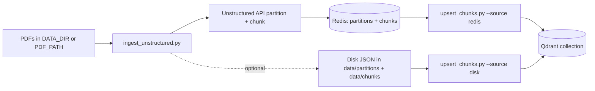
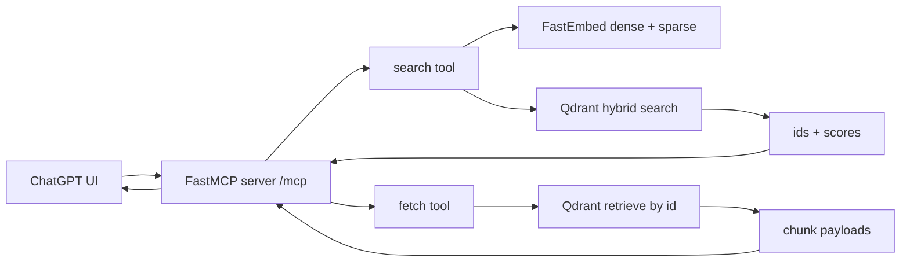

# GitHub OAuth MCP Server

FastMCP server that authenticates users via GitHub OAuth and exposes two tools (`whoami`, `ping`). It can run locally or via Docker, and includes an optional Cloudflare Tunnel sidecar for exposing the service publicly.

## Requirements
- Python 3.12+
- Docker + Docker Compose (optional, for containerized runs)
- GitHub OAuth app credentials and a public callback URL (tunnel or other)

## Install
Create a virtualenv and install dependencies:
```bash
python -m venv .venv
. .venv/bin/activate
pip install -r requirements.txt
```

(Optional) install the package in editable mode to avoid `PYTHONPATH`/`sys.path` tweaks:
```bash
pip install -e .
```

## Environment Variables
Set these in your shell or a local `.env` (keep secrets out of version control):
- `FASTMCP_SERVER_AUTH=fastmcp.server.auth.providers.github.GitHubProvider`
- `FASTMCP_SERVER_AUTH_GITHUB_CLIENT_ID` – OAuth app client ID
- `FASTMCP_SERVER_AUTH_GITHUB_CLIENT_SECRET` – OAuth app client secret
- `FASTMCP_SERVER_AUTH_GITHUB_BASE_URL` – Public base URL where `/auth` is reachable (e.g. your tunnel host)
- `CF_TUNNEL_TOKEN` – Only needed when running the Cloudflare Tunnel sidecar

## Run Locally
To test locally with GitHub OAuth, you need a public callback URL (e.g. your Cloudflare Tunnel host). Set `FASTMCP_SERVER_AUTH_GITHUB_BASE_URL` to the host root (no `/mcp` suffix), and configure your GitHub OAuth app callback to `<base_url>/auth/callback`.

```bash
python mcp_app.py
```
The server listens on `http://0.0.0.0:8000`. OAuth callbacks resolve via `FASTMCP_SERVER_AUTH_GITHUB_BASE_URL`.

## Run with Docker
Build and start the stack (FastMCP server + optional Cloudflare Tunnel):
```bash
docker compose up --build
```
- `mcp` service: serves HTTP MCP on port 8000.
- `cloudflared` service: starts a tunnel using `CF_TUNNEL_TOKEN` so the OAuth callback is reachable from GitHub.
- `minio` service: S3-compatible object storage with a web console on port 9001.

Test the running server from your terminal (requires OAuth login in a browser). Use the public tunnel URL when auth is enabled:
```bash
python examples/ping_mcp.py --url https://mcp.heley.uk/mcp
```

## MinIO buckets and uploads (UI)
The compose stack includes MinIO with a web console so you can create multiple buckets and upload files through a UI.

Start MinIO:
```bash
docker compose up minio
```

Open the console at `http://localhost:9001` and sign in with:
- `MINIO_ROOT_USER` (default `minioadmin`)
- `MINIO_ROOT_PASSWORD` (default `minioadmin`)

Storage is persisted in a Docker volume (`minio_data`) so buckets and objects survive container restarts.

## Project Layout
- `src/mcp_research/` – core Python modules.
- Top-level scripts (`mcp_app.py`, `hybrid_search.py`, `ingest_unstructured.py`, `upsert_chunks.py`) are thin wrappers for local CLI use.
- `docs/` – Sphinx documentation sources.

## Exposed Tools
- `whoami`: returns authenticated GitHub user info (`login`, `name`, `email`).
- `ping`: health check returning `"pong"`.

## Notes
- Configure your GitHub OAuth app callback to `<base_url>/auth/callback`, where `<base_url>` is `FASTMCP_SERVER_AUTH_GITHUB_BASE_URL`.
- Do not commit real OAuth secrets or tunnel tokens. Use a local `.env` only for development.

## PDF -> Qdrant ingestion
Use `ingest_pdfs.py` to extract text from PDFs with PyMuPDF, chunk it, embed with SentenceTransformers, and push vectors to the local Qdrant instance.

Environment (examples):
- `DATA_DIR` – directory containing PDFs when `PDF_PATH` is not set (default `data-raw`).
- `PDF_PATH` – optional path to a single PDF or a directory to ingest.
- `QDRANT_HOST` / `QDRANT_PORT` / `QDRANT_COLLECTION` – defaults to the local compose stack (`qdrant`, `6333`, `pdf_chunks`).
- `EMBEDDING_MODEL` – SentenceTransformers model name (default `all-MiniLM-L6-v2`).
- `CHUNK_SIZE` / `CHUNK_OVERLAP` – chunking controls (defaults `1200` / `200` characters).

Run locally:
```bash
python ingest_pdfs.py              # ingests PDFs in ./data-raw
PDF_PATH=./data-raw/my.pdf python ingest_pdfs.py  # ingest a single file
```

Run inside Docker (uses mounted `./data`):
```bash
docker compose run --rm mcp python ingest_pdfs.py
```

The script will create the `pdf_chunks` collection (if missing) and upsert chunk payloads with page hints and text for retrieval.

### Using the Unstructured API (partition + chunk)
Use `ingest_unstructured.py` when you want Unstructured to handle PDF parsing/chunking. It stores partition + chunk JSON in Redis by default (and can optionally write to disk) for inspection and deduping. The next step is to upsert chunks into Qdrant for hybrid search.

Key environment:
- `DATA_DIR` – directory of PDFs when `PDF_PATH` is not set (default `data-raw`).
- `PDF_PATH` – path to a single PDF **or** a directory (both accepted).
- `UNSTRUCTURED_API_KEY` (required) – API key for the Unstructured API.
- `UNSTRUCTURED_API_URL` – base URL (default `https://api.unstructured.io`).
- `UNSTRUCTURED_STRATEGY` – partition strategy (default `hi_res`).
- `UNSTRUCTURED_CHUNKING_STRATEGY` – chunking mode (`basic` by default, set to `none` to disable).
- `CHUNK_SIZE` / `CHUNK_OVERLAP` – forwarded to the Unstructured chunker as `max_characters` / `overlap`.
- `UNSTRUCTURED_LANGUAGES` – optional comma-separated language codes (e.g., `eng,spa`).
- `PARTITIONS_DIR` – directory for partitioned element JSON (default `data/partitions`).
- `CHUNKS_DIR` – directory for chunk JSON (default `data/chunks`).
- `REDIS_URL` – Redis connection string (e.g. `redis://localhost:6379/0`).
- `REDIS_PREFIX` – key prefix for Redis entries (default `unstructured`).
- `REDIS_SKIP_PROCESSED` – skip PDFs already in Redis (`1`/`0`, default `1`).
- `STORE_PARTITIONS_DISK` / `STORE_CHUNKS_DISK` – also write JSON to disk (`1`/`0`, default `0`).

Run locally (directory ingest, default output paths):
```bash
UNSTRUCTURED_API_KEY=your-key python ingest_unstructured.py
```

Run inside Docker (uses mounted `./data`; swap envs as needed):
```bash
UNSTRUCTURED_API_KEY=your-key docker compose run --rm mcp python ingest_unstructured.py
```

If Redis is enabled, a content hash (`document_id`) is stored per PDF to avoid reprocessing the same file bytes. The JSON payloads are stored under keys like `unstructured:pdf:<document_id>:partitions` and `unstructured:pdf:<document_id>:chunks`.
You can inspect those keys with RedisInsight (default `http://localhost:8001` when using the compose stack).

The Dockerfile uses a Python entrypoint, so you can swap commands as needed (server default remains `python mcp_app.py`).

### Upload existing JSON to Redis (same schema as Unstructured ingest)
If you already have partition/chunk JSON files in `data/partitions` + `data/chunks`, use `upload_data_to_redis.py` to populate Redis in the exact layout used by `ingest_unstructured.py`.

Upload all pairs in the default directories:
```bash
REDIS_URL=redis://localhost:6379/0 python upload_data_to_redis.py
```

Upload a single pair:
```bash
REDIS_URL=redis://localhost:6379/0 python upload_data_to_redis.py \
  --partitions-file data/partitions/example.json \
  --chunks-file data/chunks/example.json
```

### Upsert chunks into Qdrant (disk or Redis)
Use `upsert_chunks.py` to embed and upsert chunk payloads into a hybrid-search-compatible collection (named vectors `dense` + `sparse`). The chunks can come from disk or Redis.

Key environment:
- `CHUNKS_DIR` – directory containing chunk JSON files (default `data/chunks`, used with `--source disk`).
- `CHUNKS_SOURCE` – `disk` or `redis` (default `disk`).
- `REDIS_URL` / `REDIS_PREFIX` – Redis connection and key prefix (used with `--source redis`).
- `QDRANT_URL` – Qdrant URL (default `http://localhost:6333`).
- `QDRANT_COLLECTION` – target collection name (default `pdf_chunks`).
- `DENSE_MODEL` / `SPARSE_MODEL` – FastEmbed model names.

Run locally:
```bash
python upsert_chunks.py --chunks-dir ./data/chunks --collection pdf_chunks
```

From Redis:
```bash
REDIS_URL=redis://localhost:6379/0 python upsert_chunks.py --source redis --collection pdf_chunks
```

Mermaid overview (ingest -> Redis -> Qdrant):



## Hybrid search demo (local)
Use `hybrid_search.py` to run a small hybrid (dense + sparse) search against a local Qdrant instance. The script can create a demo collection, index sample docs, and then query with reciprocal rank fusion.

Prereqs:
- Qdrant running locally (e.g. `docker compose up qdrant`)
- Python deps installed: `pip install -r requirements.txt`

Environment (optional):
- `QDRANT_URL` – Qdrant URL (default `http://localhost:6333`)
- `QDRANT_COLLECTION` – collection name (default `hybrid_demo`)
- `DENSE_MODEL` – FastEmbed dense model name (default `BAAI/bge-small-en-v1.5`)
- `SPARSE_MODEL` – FastEmbed sparse model name (default `Qdrant/bm25`)

Run locally:
```bash
python hybrid_search.py "hybrid search in qdrant" --recreate
```

Custom URL/collection:
```bash
QDRANT_URL=http://localhost:6333 QDRANT_COLLECTION=my_hybrid_demo \
  python hybrid_search.py "vector search" --top-k 5 --prefetch-k 40
```

Mermaid overview (MCP search + fetch tools):



## Hybrid search examples
Two runnable scripts live in `examples/`:

Query an existing collection:
```bash
python examples/search_existing.py "your query" my_collection
```

Seed demo docs (if empty) and query:
```bash
python examples/search_demo.py "your query" demo_collection
```

Recreate the demo collection before indexing:
```bash
python examples/search_demo.py "your query" demo_collection --recreate
```

## Ingestion examples
Use the Unstructured API helpers in `examples/` to write partitions + chunks to disk:

Ingest a folder of PDFs (defaults to `DATA_DIR` or `data-raw`):
```bash
python examples/ingest_folder.py ./data-raw
```

Ingest a single PDF:
```bash
python examples/ingest_pdf.py ./data-raw/sample.pdf
```

Upsert chunk JSON into Qdrant:
```bash
python examples/upsert_chunks.py --chunks-dir ./data/chunks --collection pdf_chunks
```

Ping the MCP server locally:
```bash
python examples/ping_mcp.py --url http://localhost:8000/mcp --auth none
```
